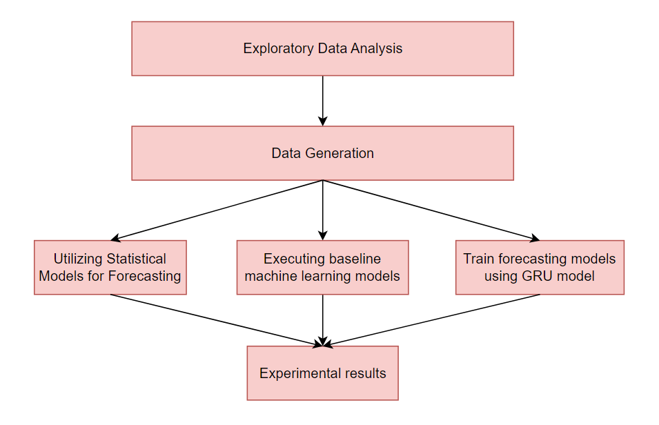

# Coding_Interview
Coding interviews test candidate's technical knowledge, coding ability

## Description
The steps process a Time Series problem


1. **Exploratory Data Analysis (EDA)**

1. **Data Generation**: We generate 3 dataset such as date_smedebtsu.csv, lag3_smedebtsu.csv, lag3_date_smedebtsu.csv

2. **Utilizing Statistical Models for Forecasting**: In this step, we traning model Prophet to analyze the model's results.

3. **Executing baseline machine learning models**: In this part, we use machine learning Linear Regression, Forest Regressor, Boosting Regressor, and Decision Tree Regressor to find out the most effective models.

4. **Train forecasting models using GRU model**: We propose a model deep-learning(GRU) to predict total debts.

5. **Experimental results**  We will analyze of above models over 3 datasets: 'date_smedebtsu,' 'lag3_smedebtsu,' and 'lag3_date_smedebtsu'


## Installation
1. Clone this repository to your local machine using the following command:
```bash
git clone https://github.com/NguyenTruongThanh-74/Coding_Interview.git
```
2. Navigate to the project directory:
```bash
cd Coding_Interview
```
3. Install jupyter notebook
```bash
pip install notebook
```
4. Install the required dependencies using the following command:
```bash
pip install -r requirements.txt
```

## How to run
### 2.1 Data Exploration
1. Initiate Jupyter Notebook by executing the following command in your terminal:
```bash
jupyter notebook
```
2. Your web browser will open, displaying the Jupyter Notebook interface.
3. Navigate to the project directory in the Jupyter Notebook interface and open the **ExploreDataTaskReport.ipynb** file in the folder notebooks.

### 2.2 Predictive Model
1. Start Jupyter Notebook by executing the following command in your terminal:
```bash
jupyter notebook
```
2. Your web browser will open, displaying the Jupyter Notebook interface.
3. Navigate to the project directory in the Jupyter Notebook interface and open the **PredictiveModelTaskReport.ipynb** file in the folder notebooks.

## Task Reports
```
Coding_Interview\task_reports
```
The folder contains PDF files with my reports on tasks and you will find individual PDF files for each task in the assignment.

## File Description
The file description provides an overview of the purpose and functionality of each file within the source code of the 
project.
```commandline
- config: The folder stores parameters, paths, and constants
- data_processing: The folder contains preprocessing functions for related data
- model: The folder contains the Deep Learning models
and Machine Learning regression models 
- notebook: The folder contains the notebook files for running
- utils.py: Utility functions used throughout the project
```
The architecture of the directory where I save data is as follows:
```
Coding_Interview\data\raw: It contains raw data.
Coding_Interview\data\processed: the folder contains the data that was processed by removing missing and removing duplicate data,...
Coding_Interview\data\features: the folder save 3 dataset created: 'date_smedebtsu,' 'lag3_smedebtsu,' and 'lag3_date_smedebtsu'
```